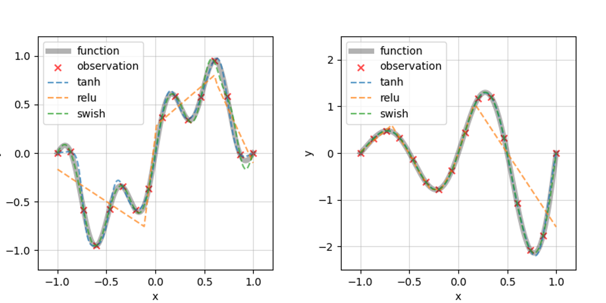

# dnn_activation
This repo is a supplementary material for [author's blog post (Japanese)](https://qiita.com/ShotaDeguchi/items/751a8ec86b7bc7ec34ed). Through a few instances, we investigate the relationship between [DNN (Deep Neural Network) approximation](https://doi.org/10.1016/0893-6080(89)90020-8) and activation function selection. 

## Purpose
Activation functions are essential to introduce non-linearity to DNNs i.e. DNN approximations are heavily dependent on the properties of the selected activation functions. This repo builds neural networks to learn several functions with 3 different activation functions, namely, ReLU, Swish, and tanh. Networks have different parameter initializations, [Glorot normal](https://proceedings.mlr.press/v9/glorot10a.html) for tanh activation, [He normal](https://arxiv.org/abs/1502.01852) for ReLU ([Nair (2010)](https://www.cs.toronto.edu/~fritz/absps/reluICML.pdf)) and Swish ([Ramachandran (2017)](http://arxiv.org/abs/1710.05941), [Elfwing (2018)](https://arxiv.org/abs/1702.03118)). 

## Example
ReLU network has zig-zag inference result, while others (tanh & Swish) have smooth approximations. This is due to their natures, to be exact, ReLU has $ C^{0} $ continuity, tanh and Swish $ C^{\infty} $. 

## Dependencies
TensorFlow environment:
|Package|Version|
|:---:|:---:|
|keras|2.8.0|
|matplotlib|3.5.1|
|numpy|1.22.1|
|pandas|1.4.0|
|scipy|1.7.3|
|tensorflow|2.8.0|

PyTorch environment:

## References
[1] [author's blog post](link). 
 
[2] Hornik, K., Stinchcombe, M., White, H.: Multilayer feedforward networks are universal approximators, *Neural Networks*, Vol. 2, No. 5, pp. Pages 359-366, 1989. ([paper](https://doi.org/10.1016/0893-6080(89)90020-8))
 
[3] Glorot, X., Bengio, Y.: Understanding the difficulty of training deep feedforward neural networks, *Proceedings of Machine Learning Research*, Vol. 9, pp. 249-256, 2010. ([paper](https://proceedings.mlr.press/v9/glorot10a.html))
 
[4] He, K., Zhang, X., Ren, S., Sun, J.: Delving Deep into Rectifiers: Surpassing Human-Level Performance on ImageNet Classification, *International Conference on Computer Vision (ICCV)*, pp. 1026-1034, 2015. ([paper](https://arxiv.org/abs/1502.01852))
 
[5] Nair, V., Hinton, G.E.: Rectified Linear Units Improve Restricted Boltzmann Machines, *International Conference on Machine Learning (ICML)*, pp. 807–814, 2010. ([paper](https://www.cs.toronto.edu/~fritz/absps/reluICML.pdf))
 
[6] Ramachandran, P., Zoph, B., Le, Q.V.: Swish: a Self-Gated Activation Function, *arXiv: 1710.05941*, 2017. ([paper](http://arxiv.org/abs/1710.05941))
 
[7] Elfwing, S., Uchibe, E., Doya, K.: Sigmoid-weighted linear units for neural network function approximation in reinforcement learning, Vol. 107, pp. 3-11, *Neural Networks*, 2018. ([paper](https://arxiv.org/abs/1702.03118))
